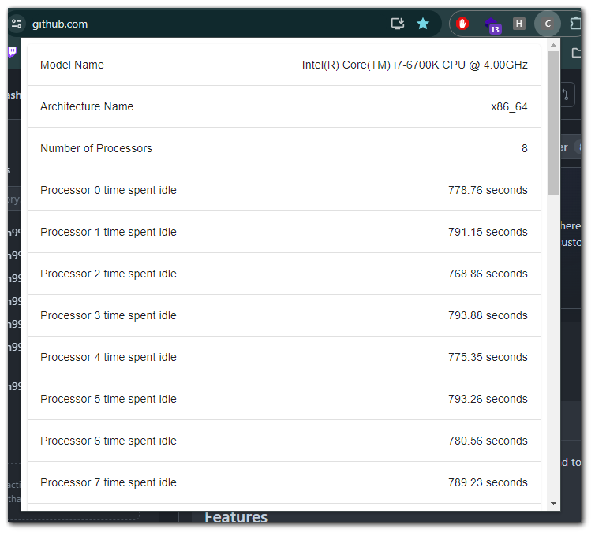

# Chrome Extension for Monitoring CPU Metrics

 
 

# Metrics
The extension shows information for the following metrics:
- The model name of the processors.
- The architecture name of the processors.
- The number of logical processors.
- The cumulative time spent idle by this processor.
- The cumulative time used by kernel programs on this processor.
- The total cumulative time for this processor. This value is equal to user + kernel + idle.
- The cumulative time used by userspace programs on this processor.
- List of CPU temperature readings from each thermal zone of the CPU.

# Installation
1) Download the repository
2) Go to chrome extensions `chrome://extensions/`
3) Enable `Developer mode`
4) Click `Load unpacked`
5) Load the `/dist` folder from the downloaded repository